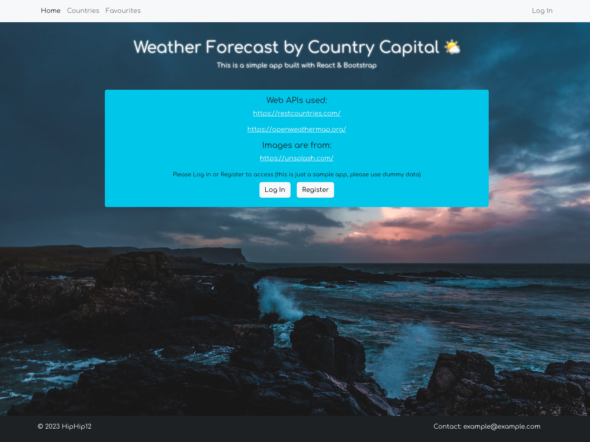
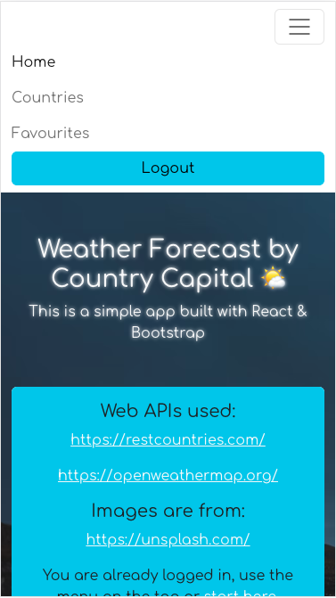
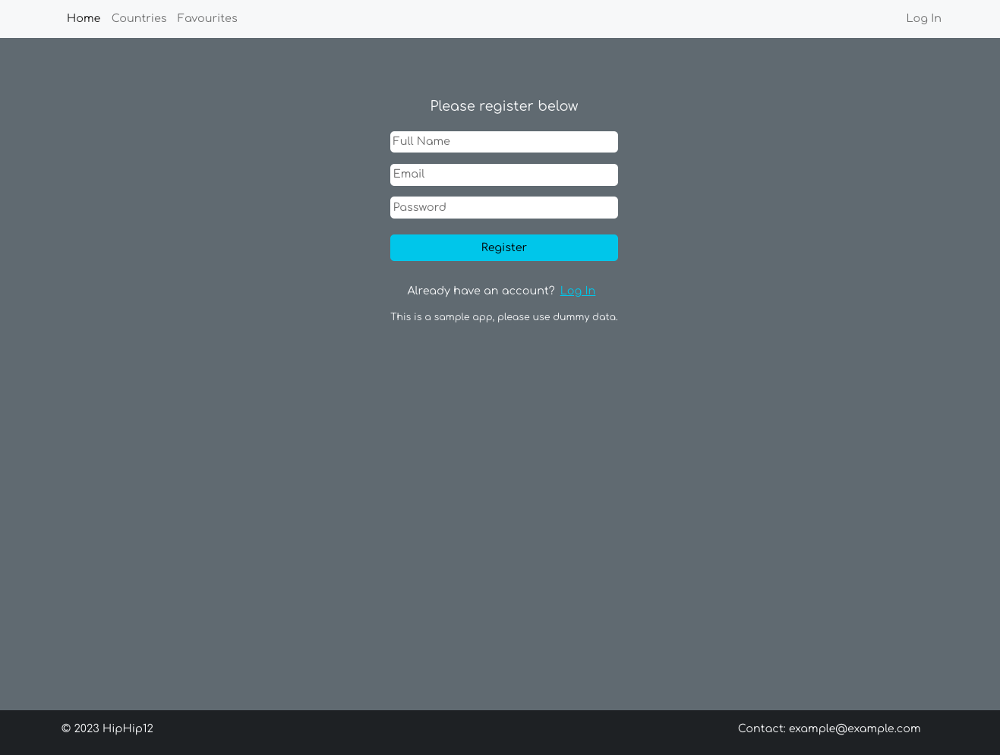
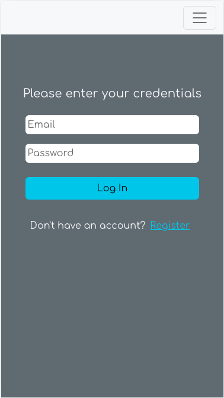
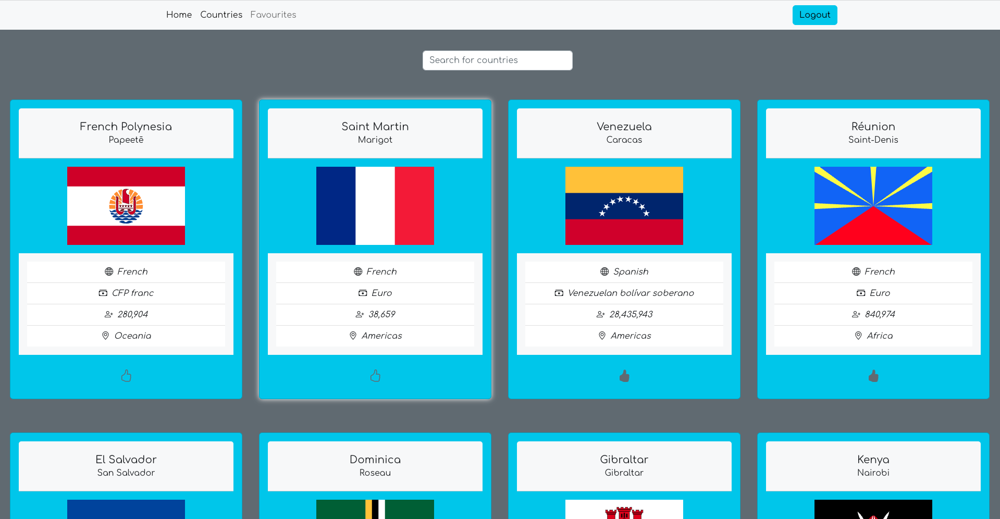
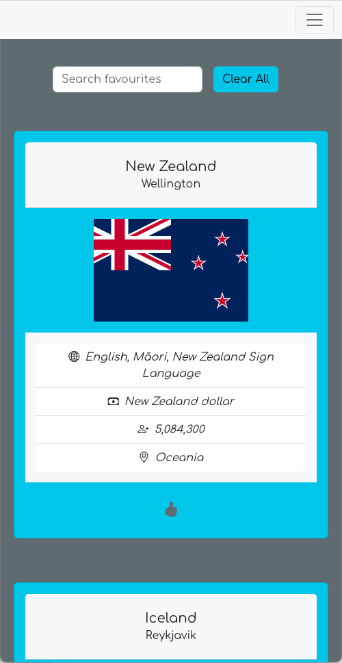
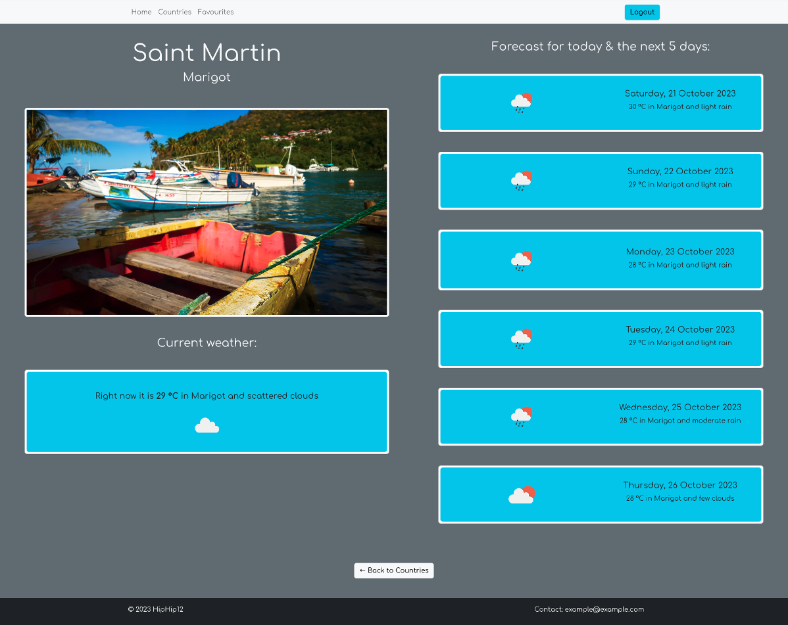
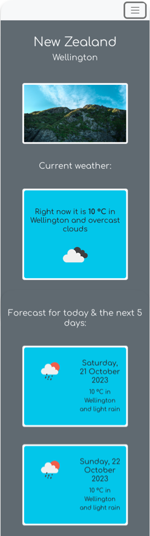
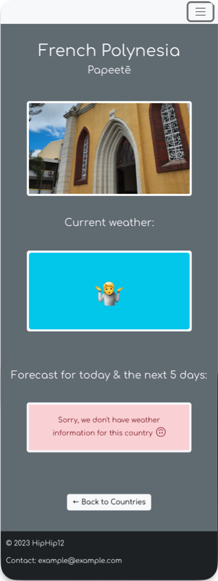

# Weather App made with React

With this app you can browse through small informative country cards, and by clicking them each one will take you to a new page with its capital's city weather status and forecast. There's also a posibility to save your favourties and access at the "Favourites" section.

The data is facilitated by the One Call API from [OpenWeather](https://openweathermap.org/) and the RESTFul API from [Rest Countries](https://restcountries.com/).

This is a project done for the Web Development program [@Helsinki Business School](https://en.bc.fi) (Oct 2023). The main focus was gettting acquinted with [Redux](https://react-redux.js.org/) and the implemention of robust authentication tools, like the ones [Google's Firebase](https://firebase.google.com/) provided for this project.

## Live page

[Try it Here!](https://scintillating-speculoos-f62937.netlify.app/)

## Technologies

- Reactjs
- React Redux
- Redux Toolkit
- Bootstrap
- Google Firebase (Authentication, and Cloud Firestore)

## Set up

```shell
git clone https://github.com/hiphip12/react-countries-bootstrap.git
cd countries-bootstrap-23k-lessons
```
add `.env` file with your private keys/ids (follow env.example)

```shell
npm install
npm start
```
## Credits

The assignment, inital codebase and guidance were provided by [Martin Holland](https://github.com/martin-holland) during Sep/Oct 2023 @Helsinki Business College(https://en.bc.fi).

Authentication backend & data storage provided by [Google's Firebase](https://firebase.google.com/)

Weather data was provided by the One Call API from [OpenWeather](https://openweathermap.org/)

Country data was provided by the RESTFul API from [Rest Countries](https://restcountries.com/)

Images provided by [unsplash.com](https://unsplash.com/photos/sea-near-rocks-during-black-clouds-pCqyc6EgQwE)

Favicon is from [unicode.org](https://unicode.org/emoji/charts/full-emoji-list.html#1f326) (code U+1F326)

## Screenshots

### Home page:
#### Desktop

#### Mobile


### Resgitration & Log In pages:
#### Desktop

#### Mobile


### Countries & Favourites pages:
#### Desktop

#### Mobile


### Weather Forecast page:
#### Desktop

#### Mobile


### No weather info page


